# 🔗 vk-links

**OSINT-инструмент для сбора дружеских связей ВКонтакте и визуализации графа в [Gephi](https://gephi.org/).**

> Работа представлена на **VII Научно-Практической Конференции РТУ МИРЭА**.


---

## ✨ Возможности

- 📥 Сбор друзей пользователя на заданную глубину.
- 🔍 Фильтрация по параметрам профиля.
- 📊 Экспорт графа в формат **GEXF** для анализа в Gephi.
- 🔗 Объединение двух графов по общим связям.
- ⚙️ Гибкая настройка через `config.json`.

> Инструмент использует **официальный VK API** и работает только с **публично доступными** данными.
---

## 🚀 Установка и запуск

### Требования

- **Python 3.11+**
- **VK API токен** — получить на [vkhost.github.io](https://vkhost.github.io/)


### Установка

```bash
git clone https://github.com/alex-50/vk-links.git
cd vk-links

# Создать виртуальное окружение (опционально)
python -m venv .venv
# Windows
.venv\Scripts\activate
# Linux / macOS
source .venv/bin/activate

# Установить зависимости
pip install -r requirements.txt
```

### Настройка токена

Добавьте токен в переменную окружения `VK_API_TOKEN`:

```bash
# Windows (cmd)
set VK_API_TOKEN=ваш_токен

# Windows (PowerShell)
$env:VK_API_TOKEN="ваш_токен"

# Linux / macOS
export VK_API_TOKEN=ваш_токен
```

Проверка:

```bash
echo $VK_API_TOKEN     # Linux / macOS
echo $env:VK_API_TOKEN # PowerShell
```

> ⚠️ Если переменная не отображается, может потребоваться перезагрузка терминала.

---

## 📖 Использование

### Обзор команд

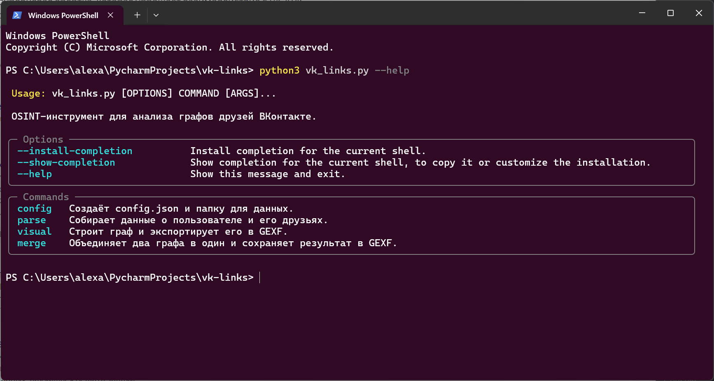

### Создание конфига

Перед первым запуском создайте `config.json` и папку для данных:

```bash
python vk_links.py config
```

Создастся:

- `config.json` — настройки (на основе `config.example.json`).
- `vk-links-data/` — папка для собранных данных и GEXF-файлов.

### Сбор данных

```bash
python vk_links.py parse id123456
python vk_links.py parse some_nickname
```

Результат: `vk-links-data/id123456.json` — данные о пользователе и его связях.

### Визуализация

```bash
python vk_links.py visual id123456
```

Результат: `vk-links-data/id123456.gexf` — граф для Gephi.

### Объединение графов

```bash
python vk_links.py merge id123456 id654321
```

Результат: `vk-links-data/id123456 + id654321(merged).gexf`.

Из второго графа добавляются только те пользователи, у которых число общих связей с первым графом **больше**
`min_degree_common_connection`.

### Подробный вывод

Все команды поддерживают флаг `--verbose` / `-v`:

```bash
python vk_links.py parse id123456 --verbose
```

Уровень логирования также можно задать через переменную окружения:

```bash
VK_LINKS_LOG_LEVEL=DEBUG python vk_links.py parse id123456
```

---

## ⚙️ Параметры `config.json`

| Параметр                       | Режим         | Описание                                             | По умолчанию               |
|--------------------------------|---------------|------------------------------------------------------|----------------------------|
| `depth`                        | parse         | Глубина обхода: 1 — друзья, 2 — друзья друзей        | 2                          |
| `min_degree`                   | parse, visual | Минимальная степень узла для попадания в граф        | 2                          |
| `crawler_depth_conditions`     | parse         | Глубина, до которой проверяются условия фильтрации   | 2                          |
| `crawler_conditions`           | parse         | Условия фильтрации: `{"ok": [...], "ignore": [...]}` | `{"ok": [], "ignore": []}` |
| `ignore_users_id`              | parse, visual | Список ID, которые нужно пропустить                  | `[]`                       |
| `min_degree_common_connection` | merge         | Минимальное число общих связей для добавления узла   | 1                          |

### Условия фильтрации

Словарь `crawler_conditions` содержит два списка условий: `ok` и `ignore`.

- **`ok`** — оставить пользователя, если он подходит хотя бы под одно условие.
- **`ignore`** — исключить пользователя, если он подходит хотя бы под одно условие.

Приоритет: если `ok` непустой — проверяется только он. Если пустой — проверяется `ignore`. Если оба пустые — фильтрация
не применяется.

**Пример** — оставить только из Москвы или Санкт-Петербурга:

```json
"crawler_conditions": {
  "ok": [
    { "city": "москва" },
    { "city": "санкт-петербург" }
  ],
  "ignore": []
}
```

**Пример** — исключить всех из школы №123:

```json
"crawler_conditions": {
  "ok": [],
  "ignore": [
    { "schools": "123" }
  ]
}
```

Проверка происходит по подстроке без учёта регистра. Глубина, до которой применяются условия, ограничивается параметром
`crawler_depth_conditions`.

---

## 🌐 Работа в Gephi

[Gephi](https://gephi.org/) — бесплатный инструмент для визуализации графов. Экспортированные `.gexf`-файлы открываются
в нём напрямую.

> Более подробно о работе с Gephi — в [официальном руководстве](https://gephi.org/users/).

### Быстрый старт

1. **File → Open** → выберите `.gexf`-файл из `vk-links-data/`.
2. Примените укладку (**Layout** → Force Atlas 2 или Yifan Hu).
3. Во вкладке **Appearance** настройте размер узлов по параметру `Degree`.
4. Включите отображение меток (**Labels**).

### Примеры визуализации

**При `min_degree=1`** (все пользователи) получается плотный граф — на скриншоте уже с применённой укладкой:

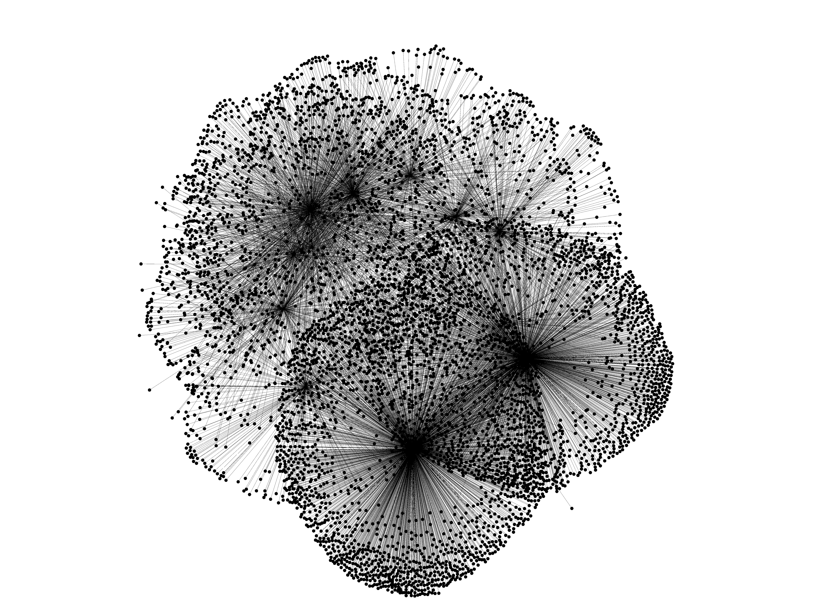

**Без укладки** граф выглядит как «чёрный квадрат»:


**Поиск по атрибутам** — например, все из РТУ МИРЭА:

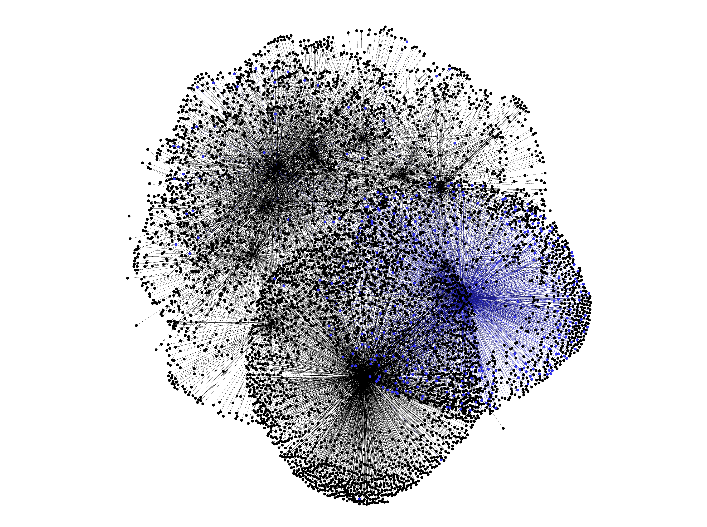

**При `min_degree=2`** остаются только пользователи с двумя и более связями — граф становится читаемым (6 тысяч → 180
вершин):

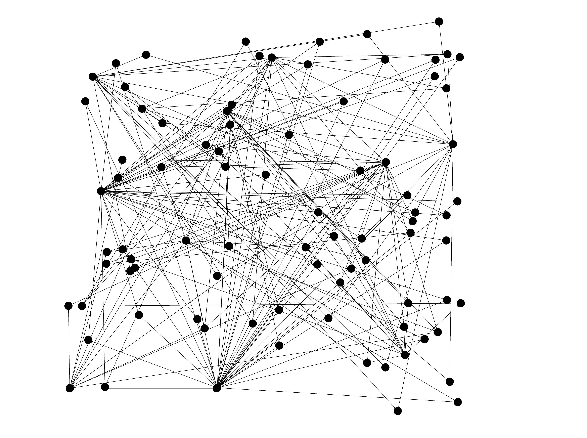

**Настройка размера узлов по степени** во вкладке Appearance:

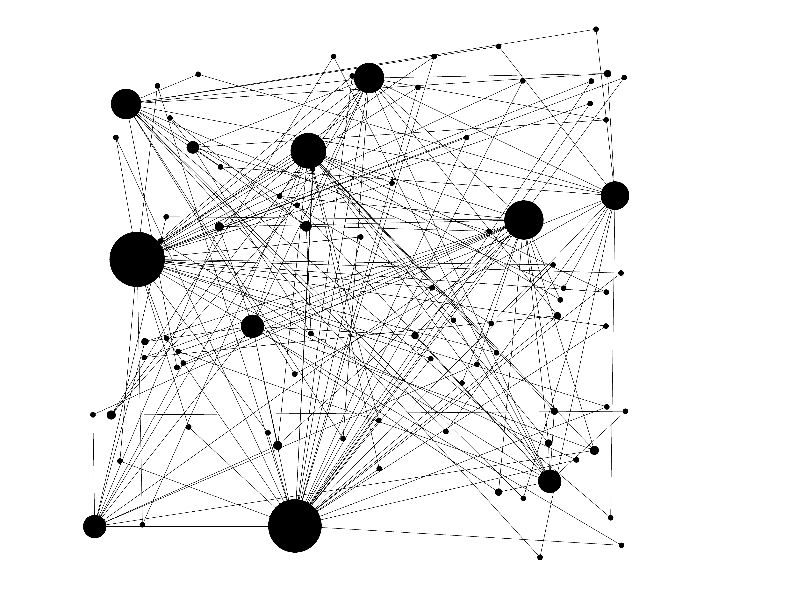

**Укладка Yifan Hu** даёт хорошую кластеризацию:

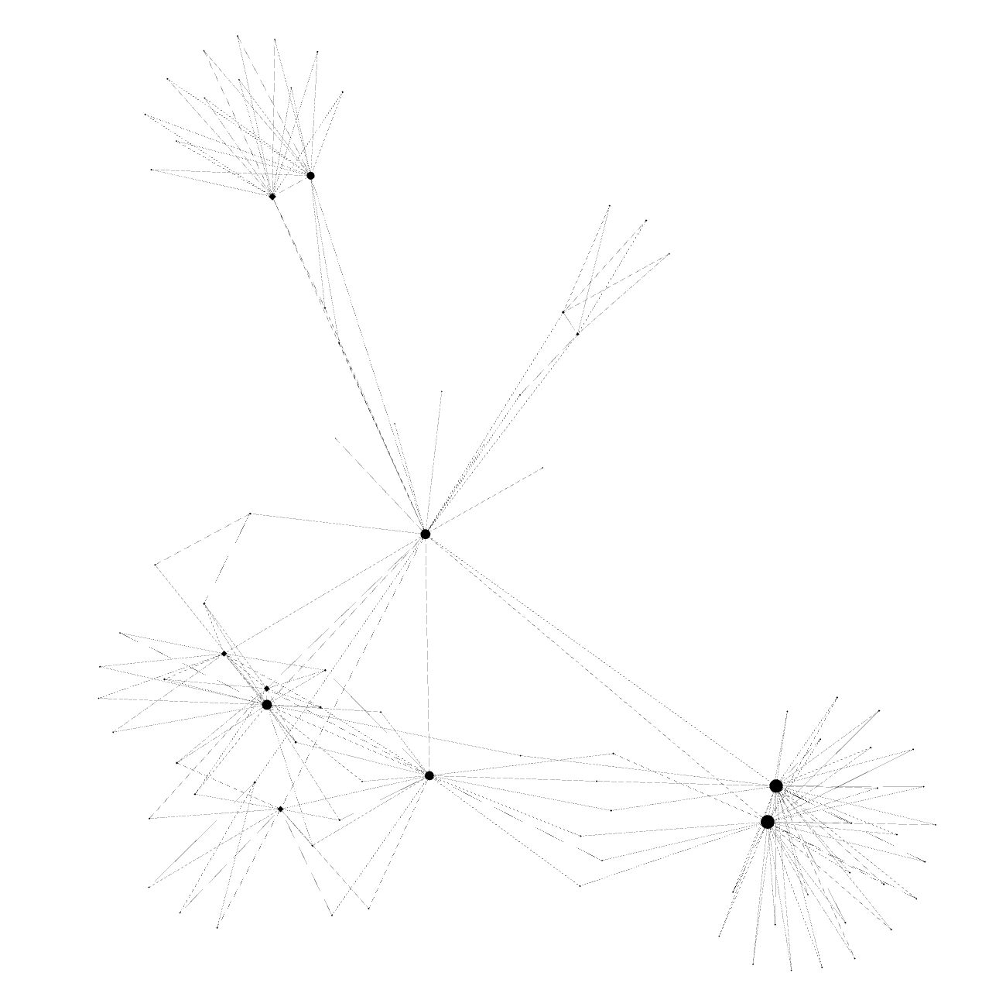

**Настройка меток** и их размера:

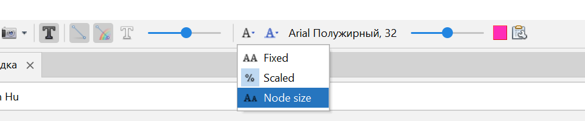
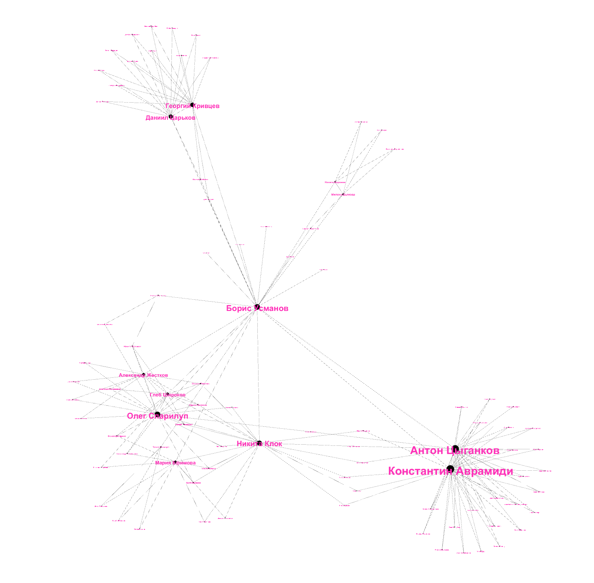

**Градиентная раскраска по удалённости** от корневого пользователя:

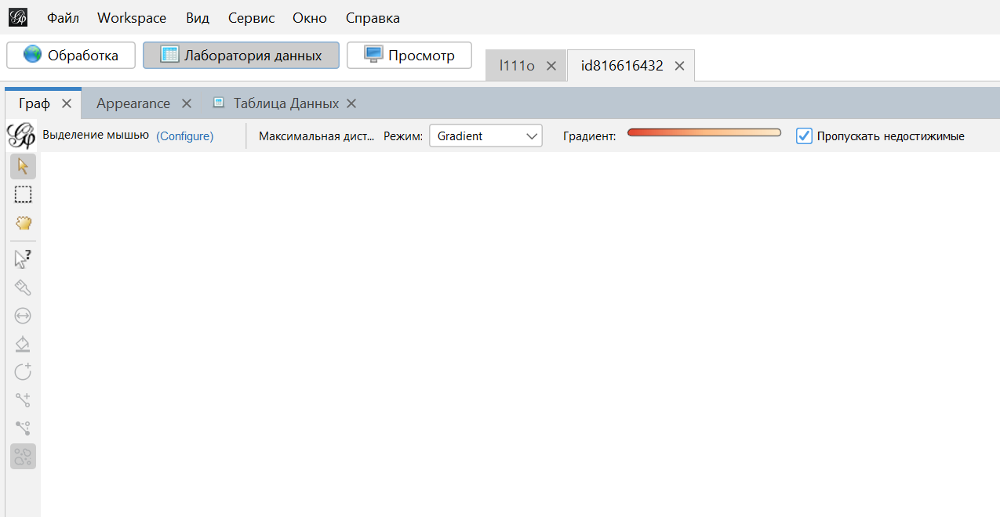
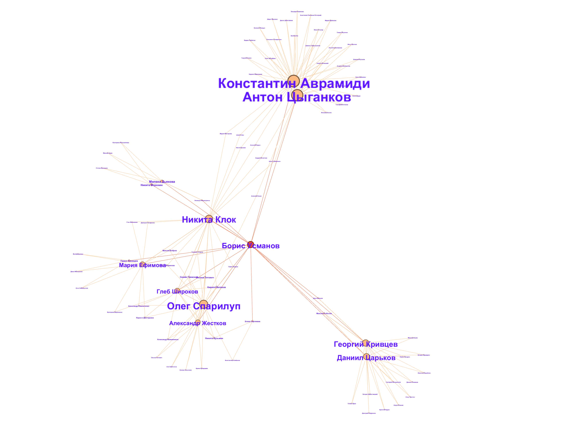

**Распределение по полу** через Data Table:

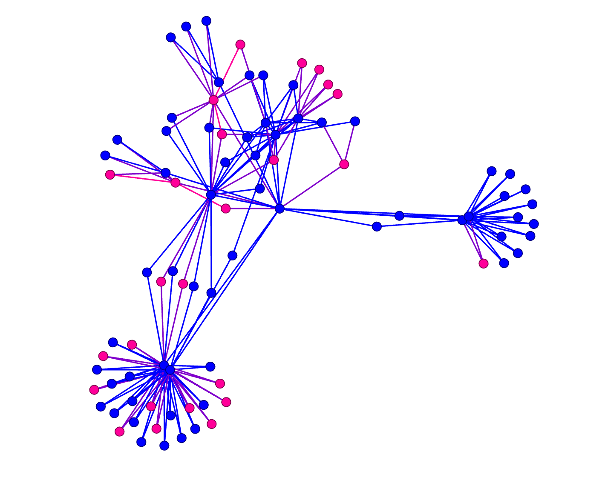

**Поиск кратчайших путей**:

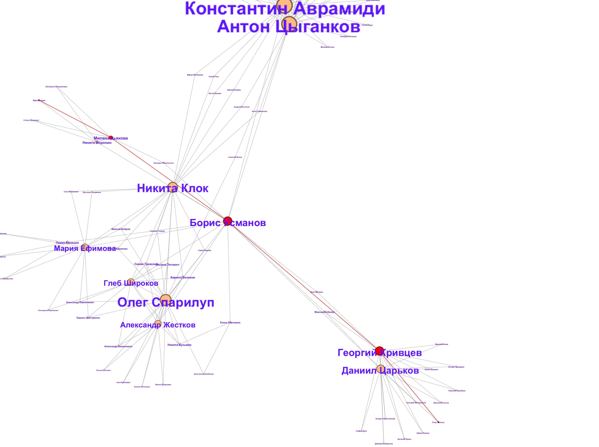

**Раскраска по количеству связей**:

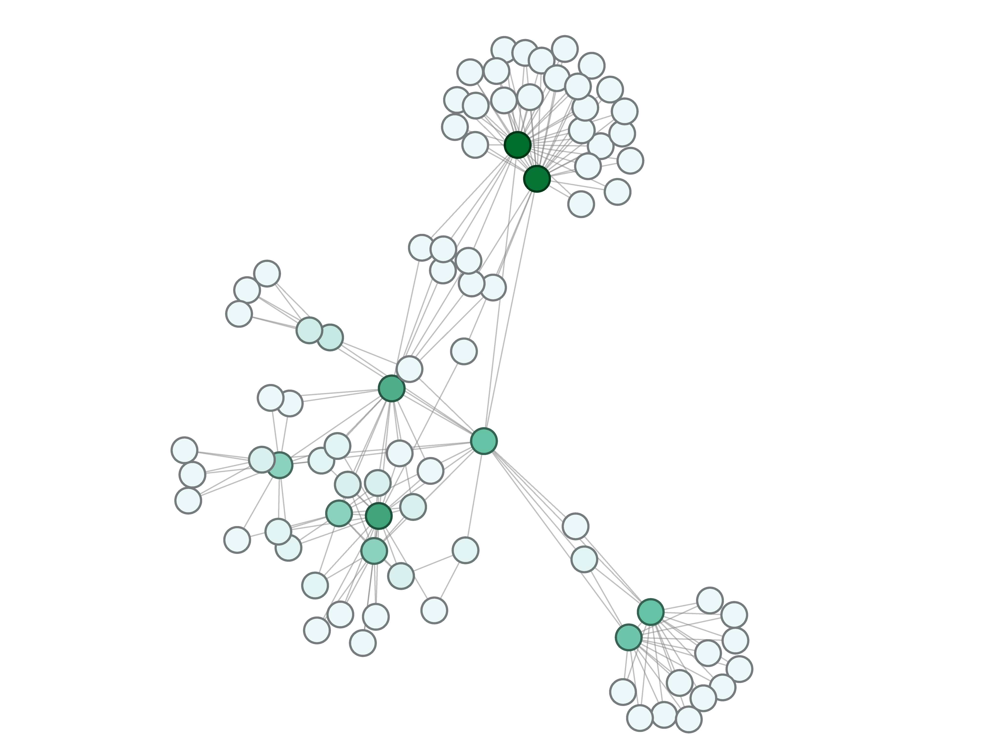

---

## 📁 Структура проекта

```
vk-links/
├── vk_links.py                    # точка входа
├── vk_links/                      # основной пакет
│   ├── __init__.py
│   ├── cli.py                     # команды на typer
│   ├── config.py                  # dataclasses настроек
│   ├── constants.py               # константы
│   ├── paths.py                   # пути к файлам
│   ├── file_io.py                 # работа с JSON
│   ├── vk_client.py               # обёртка над VK API
│   ├── data_loader.py             # рекурсивный сбор данных
│   └── graph_builder.py           # построение графа и GEXF
│
├── config.example.json            # шаблон конфига
├── requirements.txt
├── screenshots/                   # скриншоты для README
└── README.md
```

Личные данные не хранятся в репозитории:

- `config.json` — в `.gitignore`
- `vk-links-data/` — в `.gitignore`

---

## 🛠 Стек

- **Python 3.11**
- **[vk](https://pypi.org/project/vk/)** — python-обёртка для VK API
- **[networkx](https://networkx.org/)** — построение графа
- **[typer](https://typer.tiangolo.com/)** — CLI
- **[rich](https://rich.readthedocs.io/)** — форматирование вывода

---

## 📄 Лицензия

Проект создан в учебных и исследовательских целях. Используйте ответственно.

---

**[Экспериментируйте!](https://gephi.org/users/)**

