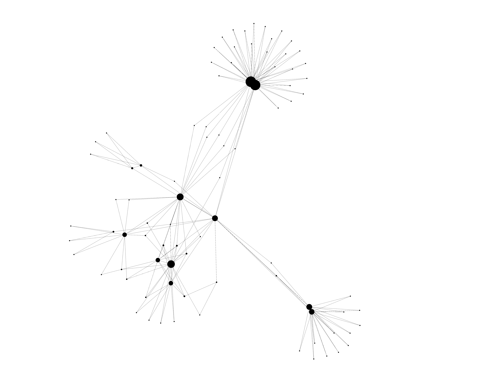
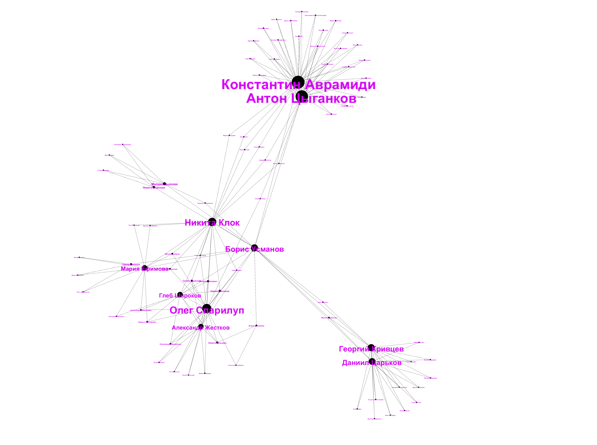

# vk-links

OSINT-инструмент для сбора дружеских связей в социальной сети ВКонтакте и дальнейшей визуализации
в [Gephi](https://github.com/gephi/gephi).


## Начало работы

Проект создан на **Python 3.11** - убедитесь в том, что у вас стоит необходимая версия.

```
python3 --version
```

Скачайте проект c помощью git, либо скачайте репозиторий как zip-архив и распакуйте его. Затем перейдите в директорию
проекта.

```bash
~$ git clone https://github.com/alex-50/vk-links.git
~$ cd vk-links
```

Установите необоходимые бибилотеки

```bash
~/vk-links$ pip install -r requirements.txt
```

Добавьте VK API токен в системную переменную VK_API_TOKEN, а затем проверьте - возможно потребуется перезагрузить
компьютер.

```bash
~$ echo $VK_API_TOKEN
```

## Аргументы командной строки

#### -m / --mode (обязательный всегда) - режим в которм работает скрипт

#### -u / --userids - ids пользователя (вместо ids можно указать "id<USER_ID>")

#### -u2 / --userids2 - ids второго пользователя для режима --mode=merge (склейка графов)

## Режимы работы

### Генерация файла с конфигурациями поиска

Параметр "--mode", или "-m" - это режим, в котором работает скрипт.
При начале работы надо сгенерировать файл конфигураций.

```
~/vk-links$ python3 vk-links.py --mode=config
```

В директории проекта также создастся папка "./vk-links-data", если её ранее не было. Туда сохраняются все собранные
файлы с данными в виде <userids>.json и файлы Gephi <userids>.gexf

### Сбор данных о пользователе

Чтобы собрать данные о конкретном пользователе в ВК укажите режим "parse", а в --userids передайте никнейм пользователя,
либо его id в формате "id<USER_ID>".

```
~/vk-links$ python3 vk-links.py --mode=parse --userids=id1
```

или

```
~/vk-links$ python3 vk-links.py --mode=parse --userids=durov
```

После сбора всех данных будет создан файл <userids>.json, где будут сохранены данные о пользователях и их связях.

### Визуализация

Теперь данные надо визуализировать - для этого сделайте тоже самое, но с режимом visual

```
~/vk-links$ python3 vk-links.py --mode=visual --userids=...
```

## Параметры поиска и визуализации

Данные парпаметры находятся в файле config.json и могут быть изменены вручную, либо сброшены в начальный вид с помощью
--mode=сonfig, который по умолчанию генерирует следующие значения:

```json 
{
  "depth": 2,
  "min_degree": 2,
  "crawler_depth_conditions": 2,
  "request_fields": [
    "city",
    "school",
    "university",
    "work",
    "home_town"
  ],
  "crawler_conditions": {
    "ok": [],
    "ignore": []
  },
  "ignore_users_id": [],
  "min_degree_common_connection": 1,
  "save_path": "C:\\Users\\alexa\\PycharmProjects\\vk-links\\vk-links-data\\"
}
```

## Работа в Gephi

Я не буду углубляться во все тонкости работы с таким мощным инструментом как Gephi - вы сами можете много прочитать в
разделе [начала работы](https://gephi.org/users/).
Тут разберём несложную визуализацию моего товарища.

При открытиии файла .gexf в Gephi, можно увидеть чёрно-белый граф


Для начала во вкладке Appearance можно выбрать параметр Degree и увеличить узлы настолько, как вы этого хотите.
В большинстве случаев подходит min size равный 5-10, а max size 50 - 200.


После применения изменений граф приобретёт следующий вид


Затем можем применить укладку - как правило в большинстве случаев подойдут алгоритмы Force Atlas или Yifan Hu. Также не
забудьте выставить нужные параметры, которые позволят сделать ваш граф более визуально понятным.


После применения получим

Как видите получилось здорово кластеризовать граф. Теперь ясно кто и с кем чаще всего контактирует и каким образом они
могут быть связаы между собой.

Теперь можно отобразить Labels всех узлов, выбрать их цвет. Также возможно вам будет удобно применить параметр Node Size
для того, чтобы размер меток соответствовал узлам.



Для наглядности удаления узлов от главного пользователя, можно применить градиентную раскраску узлов.

Выберите этот режим, а затем нажмите на главного пользователя (или налюбого другого, удалённость от которого хотите
исследовать).


Эксперементируйте!