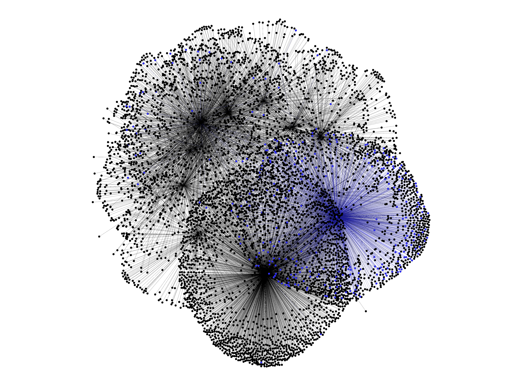

vk-links
=

OSINT-инструмент для сбора дружеских связей в социальной сети ВКонтакте и дальнейшей визуализации
в [Gephi](https://github.com/gephi/gephi).


Установка
--

Убедитесь в том, что у вас стоит интерпретатор по-новее - я писал на **Python 3.11**.

```bash
~$ python3 --version
```

Скачайте проект c помощью git, либо скачайте репозиторий как zip-архив и распакуйте его. Затем перейдите в директорию
проекта.

```bash
~$ git clone https://github.com/alex-50/vk-links.git
~$ cd vk-links
```

Установите необоходимые бибилотеки

```bash
~/vk-links$ pip install -r requirements.txt
```

Получите свой токен VK API. Легко это можно сделать на https://vkhost.github.io/


Добавьте токен в системную переменную VK_API_TOKEN, а затем проверьте - возможно потребуется перезагрузка, если
переменная не отображается.

```bash
~$ echo $VK_API_TOKEN
```

Аргументы командной строки
--

#### -m / --mode (обязательный всегда) - режим в которм работает скрипт

#### -u / --userids - ids пользователя (вместо ids можно указать "id<USER_ID>")

#### -u2 / --userids2 - ids второго пользователя для режима --mode=merge (склейка графов)

###              

### Генерация файла с конфигурациями поиска (--mode=config)

Параметр "--mode", или "-m" - это режим, в котором работает скрипт.
В начале работы надо сгенерировать файл конфигураций. Далее разберём подробнее что внутри него.

```
~/vk-links$ python3 vk-links.py --mode=config
```

В директории проекта также создастся папка "./vk-links-data", если её ранее не было. Туда сохраняются все собранные
файлы с данными в виде <userids>.json и файлы Gephi <userids>.gexf

### Сбор данных о пользователе (--mode=parse)

Чтобы собрать данные о конкретном пользователе в ВК укажите режим "parse", а в --userids передайте никнейм пользователя,
либо его id в формате "id<USER_ID>".

```
~/vk-links$ python3 vk-links.py --mode=parse --userids=id1
```

или

```
~/vk-links$ python3 vk-links.py --mode=parse --userids=durov
```

После сбора всех данных будет создан файл <userids>.json, где будут сохранены данные о пользователях и их связях.

### Визуализация (--mode=visual)

Теперь данные надо визуализировать - для этого сделайте тоже самое, но с режимом visual

```
~/vk-links$ python3 vk-links.py --mode=visual --userids=...
```

Параметры поиска и визуализации (файл config.json)
--
Данные парпаметры находятся в файле config.json и могут быть изменены вручную, либо сброшены в начальный вид с помощью
--mode=сonfig, который по умолчанию генерирует следующие значения:

```json 
{
  "depth": 2,
  "min_degree": 2,
  "crawler_depth_conditions": 2,
  "request_fields": [
    "city",
    "home_town",
    "status",
    "sex",
    "site",
    "about",
    "domain",
    "occupation",
    "schools",
    "universities"
  ],
  "crawler_conditions": {
    "ok": [],
    "ignore": []
  },
  "ignore_users_id": [],
  "min_degree_common_connection": 1,
  "save_path": "C:\\Users\\alexa\\PycharmProjects\\vk-links\\vk-links-data\\"
}
```

| Параметр                         |          Режим           |                                                                                                                                                                                                                                                                                                           Описание                                                                                                                                                                                                                                                                                                           |                                                                                                             Значение по умолчанию                                                                                                              |
|----------------------------------|:------------------------:|:----------------------------------------------------------------------------------------------------------------------------------------------------------------------------------------------------------------------------------------------------------------------------------------------------------------------------------------------------------------------------------------------------------------------------------------------------------------------------------------------------------------------------------------------------------------------------------------------------------------------------:|:----------------------------------------------------------------------------------------------------------------------------------------------------------------------------------------------------------------------------------------------:|
| **depth**                        |          parse           |                                                                                                                                                                                                                                                                           Глубина захода. На взаимосвязь между собой самый нижний не проверяется.                                                                                                                                                                                                                                                                            |                                                                                         2 - друзья и их друзья (связи между друзьями друзей не будет).                                                                                         |
| **min_degree**                   |      parse / visual      |                                                                                                                                                                                                                                                                            Минимальная степень узла - минимальное количество связей пользователя.                                                                                                                                                                                                                                                                            |                                                                                                                       2                                                                                                                        |
| **crawler_depth_conditions**     |          parse           |                                                                                                                                                                                                                                                            Глубина, до которой проверяется условие. В большинстве случаев её можно устанавливать равной **depth**                                                                                                                                                                                                                                                            |                                                                                                                       2                                                                                                                        |
| **crawler_conditions**           |          parse           |  Условия по которым проверяется пользователь. Могут быть либо "ok", либо "ignore".<br/> Если нет условий "ok", начинают проверяться услвоия "ignore". <br/>Если нет никаких условий, то пользователь не проверяется.<br/><br/>Пример запроса:<br/> ```"ok":[{"city": "москва", "schools": "123"}, {"city": "санкт-петербург", "schools": "лицей"}]```. <br/>При сборе данных будут учитываться только люди из Москвы, в названии школы которых есть "123" или Петербурга, в названии школы которых есть "лицей".<br/><br/> Запросы ```"ignore": [{...}, ....]``` работают аналогично и отсеивают тех, кто под них подходит.  |                                                                                    ```{"ok": [], "ignore": []}```<br/>По умолчанию условия не генерируются.                                                                                    |
| **request_fields**               |          parse           |                                                                                                                                                                                                                                                                                   Параметры, которые собираются со страниц пользователей.                                                                                                                                                                                                                                                                                    |  По умолчанию генерируются все, обработка которых реализована на данный момент.<br/>```"request_fields": ["city","home_town",    "status",    "sex",    "site",    "about",    "domain",    "occupation",    "schools",    "universities"]```  |
| **ignore_users_id**              |      parse  /visual      |                                                                                                                                                                                                                                            Список id, которые надо игнорировать. Будет полезно, когда в графе имеется неинтересный пользователь, который может быть очень тяжёл.                                                                                                                                                                                                                                             |                                                                                              По умолчанию список  пуст. ```request_fields: []```                                                                                               |
| **min_degree_common_connection** |          merge           |                                                                                                                                                                                                                                                                                 Минимальная связь вершины из графа userids с узлами userids2                                                                                                                                                                                                                                                                                 |                                                                                                                       1                                                                                                                        |
| **save_path**                    | parse / visual / config  |                                                                                                                                                                                                                                                                      Директория, куда будут сохраняться собранные данные и сгенерированные файлы .gexf                                                                                                                                                                                                                                                                       |                                                                                                      ```../{SCRIPT_DIR}/vk-links-data/```                                                                                                      |

Обратите внимание, что некоторые параметры могут работать в нескольких режимах. Например, игнорируемых пользователей
можно не собирать изначально, а можно собрать, но не выводить на граф.

## Работа в Gephi

Я не буду углубляться во все тонкости работы с таким мощным инструментом как Gephi - вы сами можете много прочитать в
разделе [начала работы](https://gephi.org/users/).
Тут разберём несложную визуализацию моего товарища - Бориса.

Сначала я собрал его данные, а затем перевёл в формат gexf.

При параметре min_degree=1 (по сути все, кто есть на графе) получим 6 тысяч вершин.

На данной картинке я уже применил укладку, если вы только открыли граф, то он будет "чёрным квадратом".
Вероятно как-то так.


Перейдя в Таблицу данных, я нашёл всех людей с подстрокой "РТУ МИРЭА", в параметре университетов и подсветил их.


Для более детального анализа минимальную степень графа надо увеличивать. Далее рассмотрим граф с минимальной степенью 2.
В таком графе количество вершин уменьшилось с 6 тысяч до 180 (примерно в 30 раз меньше)


Для начала во вкладке Appearance можно выбрать параметр Degree и увеличить узлы настолько, как вы этого хотите.
В большинстве случаев подходит min size равный 5-10, а max size 50 - 200.
После применения изменений граф приобретёт следующий вид


Затем можем применить укладку - как правило, в большинстве случаев подойдут алгоритмы Force Atlas или Yifan Hu. Также не
забудьте выставить нужные параметры, которые позволят сделать ваш граф более визуально понятным.
После применения получим

Как видите, получилось здорово кластеризовать граф. Теперь ясно кто и с кем чаще всего контактирует и каким образом они
могут быть связны между собой.

Теперь можно отобразить Labels всех узлов, выбрать их цвет. Также возможно вам будет удобно применить параметр Node Size
для того, чтобы размер меток соответствовал узлам.


Для наглядности удаления узлов от главного пользователя, можно применить градиентную раскраску узлов.

Выберите этот режим, а затем нажмите на главного пользователя (или на любого другого, удалённость от которого хотите
исследовать).


А при помощи таблицы данных вы можете исследовать графы на различные параметры.
Вот к примеру тот же граф, отражающий содержание мужчин и женщин.


Также Gephi позволяет искать кратчайшие пути.


А градиентную раскраску можно применять и во количеству вершин.


---

**[Экспериментируйте!](https://gephi.org/users/)**

---